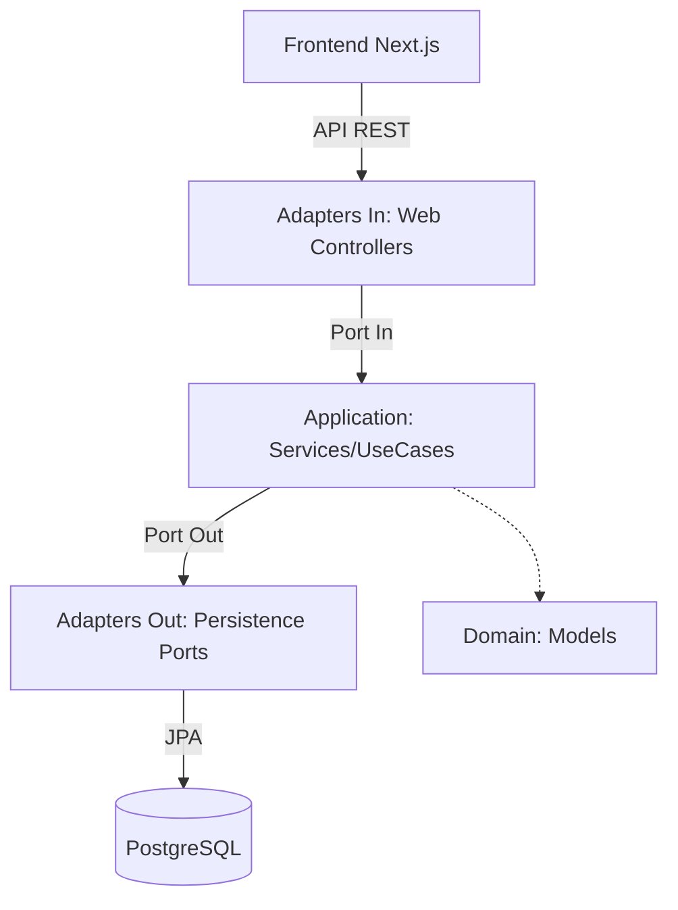
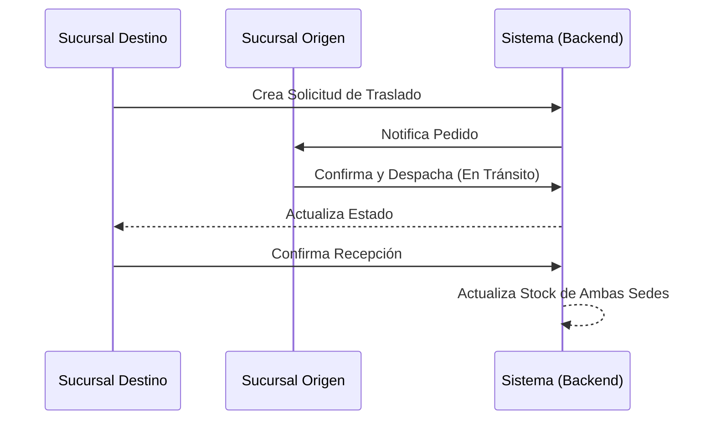

# Zenvory - Sistema de Inventario Multi-Sucursal

Este proyecto es una solución integral para la gestión de inventarios en organizaciones con múltiples sedes. Diseñado bajo los más altos estándares de arquitectura de software, permite una operación autónoma por sucursal mientras mantiene una visión consolidada para el Administrador Global.

## 1. Arquitectura del Sistema

El sistema implementa una **Arquitectura Hexagonal (Ports & Adapters)**, garantizando una separación clara entre la lógica de negocio y las dependencias externas.

### Capas del Proyecto:
- **Capa de Dominio**: Modelos de negocio puros (`Inventory`, `Product`, `Transfer`) sin dependencias de frameworks.
- **Capa de Aplicación**: Casos de uso (`InventoryUseCase`, `TransferUseCase`) definidos mediante interfaces (Ports).
- **Capa de Infraestructura**: Adaptadores para persistencia (PostgreSQL/JPA), API REST y seguridad (JWT).
- **Frontend**: Single Page Application (SPA) responsiva desarrollada con Next.js y TypeScript.

### Decisiones Técnicas:
- **Backend: Java/Spring Boot**: Elegido por su robustez en transacciones y soporte nativo para arquitectura multicapa.
- **Base de Datos: PostgreSQL**: Motor relacional que garantiza la integridad de los datos financieros y de trazabilidad.
- **Seguridad: JWT**: Implementación de tokens para autenticación sin estado, necesaria para la escalabilidad.
- **Sincronización**: Procesamiento en tiempo real mediante transacciones atómicas que aseguran que el stock nunca "desaparezca" durante traslados.

## 2. Módulos Implementados

1.  **Dashboard Administrativo**: KPIs globales de ventas, valorización de inventario y comparativa de sucursales.
2.  **Gestión de Inventario**: CRUD completo con alertas de stock mínimo automático.
3.  **Auditoría y Trazabilidad**: (Funcionalidad Adicional) Registro inmutable de cada movimiento realizado en la red.
4.  **Traslados Inteligentes**: Ciclo completo de Solicitud -> Envío -> Recepción (Total o Parcial).
5.  **Catálogo Maestro de Productos**: Gestión centralizada de unidades de medida y costos promedio ponderados.
6.  **Gestión de Ventas y Compras**: Registro de transacciones con afectación automática de inventario.

## 3. Diagramas de Ingeniería

### Arquitectura de Capas


### Flujo de Traslado (Sección 3.4)


## 4. Instalación y Ejecución

El proyecto está completamente contenedorizado para ejecutarse en entornos Linux, macOS o Windows.

**Requisitos**: Docker y Docker Compose instalados.

1.  Clonar el repositorio.
2.  Ejecutar el siguiente comando en la raíz:
    ```bash
    docker compose up --build -d
    ```
3.  Acceder a la aplicación:
    - **Frontend**: http://localhost:3000
    - **Backend API**: http://localhost:8080/swagger-ui.html (Documentación OpenAPI)

### Credenciales de Prueba:
- **Admin**: `admin@zenvory.com` / `admin123`
- **Operador**: `sede.norte@zenvory.com` / `password123`

## 5. Justificación del Uso de IA
Consulte el archivo [AI_USAGE.md](file:///home/yep/zenvory-prueba-tecnica/AI_USAGE.md) para ver la documentación detallada sobre cómo se utilizó la Inteligencia Artificial para potenciar el desarrollo de este proyecto.
