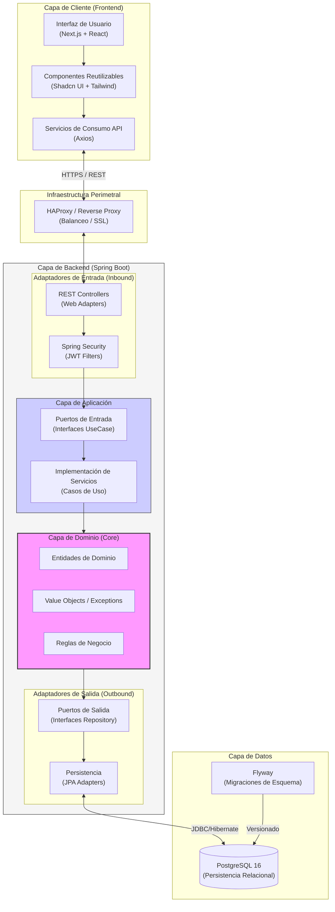
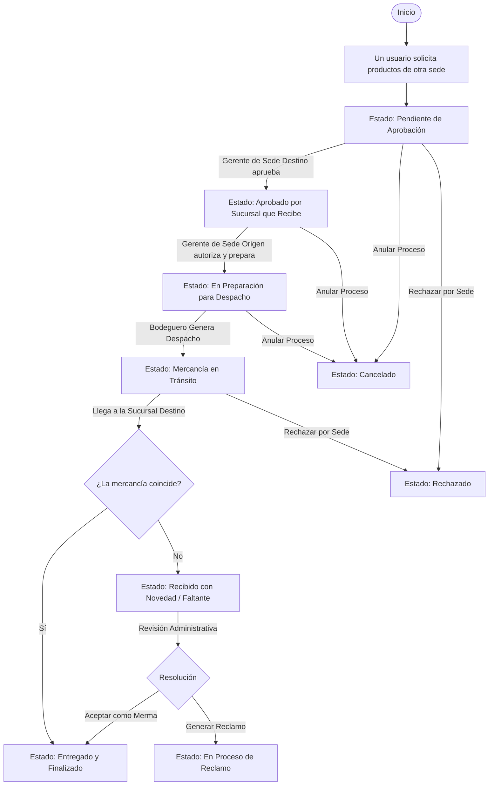
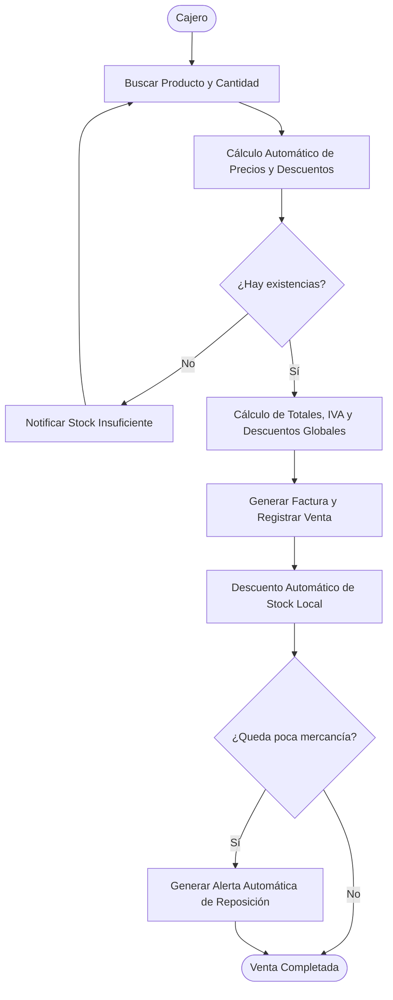

# Zen Inventory - ERP de Gestión de Inventarios Multi-Sucursal

Zen Inventory es una plataforma integral diseñada para la gestión logística y comercial de empresas con múltiples sedes. El sistema permite el control en tiempo real de existencias, ventas personalizadas por sede, traslados entre sucursales y procesos de compra a proveedores, todo bajo una arquitectura robusta y escalable.

---

## Características Principales

### Gestión de Inventario

- Control de stock por sucursal con sistema de alertas de stock mínimo.
- Historial detallado de movimientos (Entradas, Salidas, Ajustes, Ventas, Traslados).
- Gestión de unidades de medida y proveedores por producto.

### Ventas y Facturación (POS)

- Múltiples listas de precios (Base, Global, por Cliente/Sede).
- Aplicación de descuentos por ítem y descuentos globales.
- Cálculo de impuestos y totales centralizado en el backend.
- Registro de clientes y anulación de facturas con reversión automática de stock.

### Logística y Traslados

- Proceso de traslado entre sedes con cadena de aprobación (Sede Destino -> Sede Origen).
- Control de estados: Pendiente, En Preparación, En Tránsito, Recibido.
- Gestión de novedades en recepción (Mermas y Reclamos).

### Compras y Recepción

- Órdenes de compra a proveedores.
- Recepción de mercancía con actualización automática de Inventario y Costo Promedio Ponderado (CPP).

### Análisis y Reportes

- Dashboard con indicadores clave de rendimiento (KPIs).
- Análisis de productos más vendidos y niveles de inventario crítico.

---

## Arquitectura del Sistema

El backend está construido bajo el patrón de **Arquitectura Hexagonal (Puertos y Adaptadores)**, asegurando que la lógica de negocio esté completamente aislada de la infraestructura (Base de datos, API, etc.).



---

## Flujos de Procesos

### 1. Flujo de Transferencia entre Sucursales

Garantiza que el movimiento de mercancía entre sedes sea autorizado por ambas partes.



### 2. Flujo de Venta (POS)

Optimizado para transacciones rápidas con validación de stock en tiempo real.



---

## Stack Tecnológico

| Componente            | Tecnología                                              |
| :-------------------- | :------------------------------------------------------ |
| **Backend**           | Java 21, Spring Boot 3.5, Spring Security, JWT          |
| **Frontend**          | Next.js 14 (App Router), React, Tailwind CSS, Shadcn UI |
| **Base de Datos**     | PostgreSQL 16                                           |
| **Persistencia**      | Spring Data JPA, Hibernate                              |
| **Migraciones**       | Flyway                                                  |
| **Documentación API** | Springdoc OpenAPI (Swagger)                             |
| **Contenerización**   | Docker, Docker Compose                                  |

---

## Instalación y Configuración

### Prerrequisitos

- Docker y Docker Compose instalados.
- Java 21+ (si se corre fuera de Docker).
- Node.js 20+ (si se corre fuera de Docker).

### 1. Clonar el Repositorio

```bash
git clone https://github.com/tu-usuario/optiplant-prueba-tecnica.git
cd optiplant-prueba-tecnica
```

### 2. Ejecución con Docker (Recomendado)

Para levantar todo el ecosistema (DB, Backend, Frontend, pgAdmin):

```bash
docker-compose up --build -d
```

- **Frontend:** `http://localhost:3000`
- **Backend API:** `http://localhost:8080/api`
- **pgAdmin:** `http://localhost:5050`

### 3. Ejecución en Modo Desarrollo (Local)

**Backend:**

```bash
cd backend
./mvnw clean spring-boot:run
```

**Frontend:**

```bash
cd frontend
npm install
npm run dev
```

---

## Documentación de la API

Una vez el backend esté en ejecución, puedes acceder a la documentación interactiva en:
`http://localhost:8080/api/swagger-ui.html`

---

## Seguridad y Roles

La autenticación se maneja vía **JWT (JSON Web Tokens)**. Los roles principales definidos son:

- `ADMIN`: Acceso total al sistema.
- `MANAGER`: Gestión de sucursal y aprobaciones de compra/traslado.
- `OPERATOR`: Gestión de movimientos de bodega y despachos.
- `CASHIER`: Punto de venta y atención al cliente.
