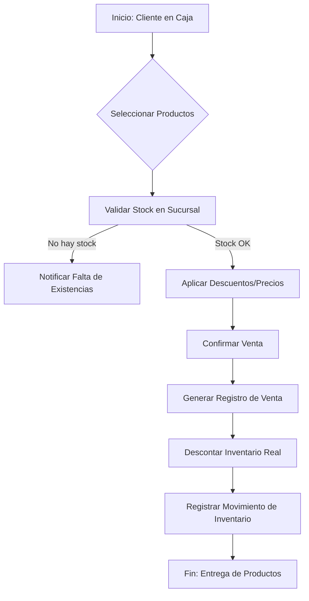
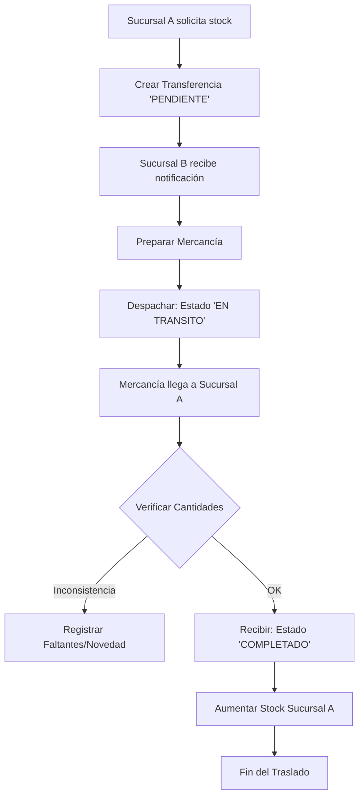
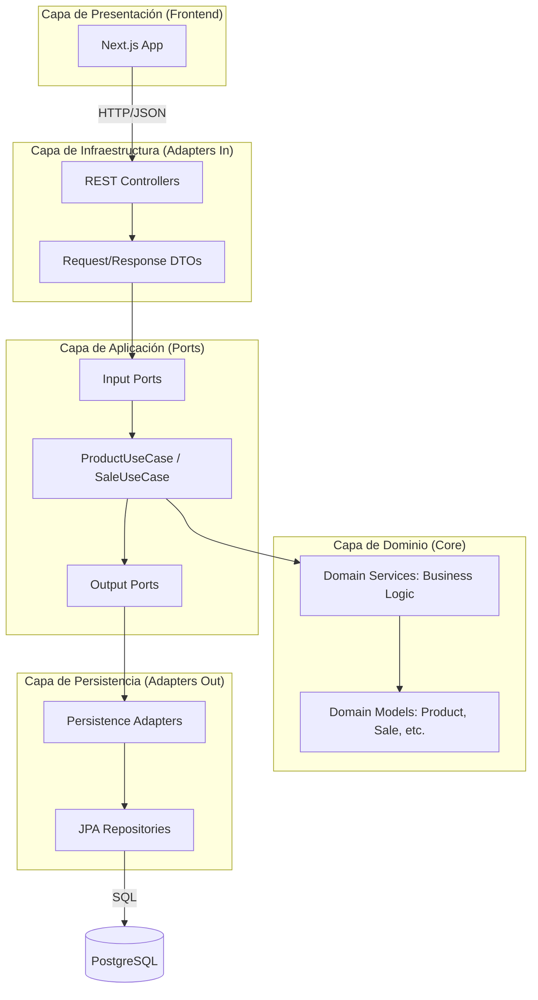
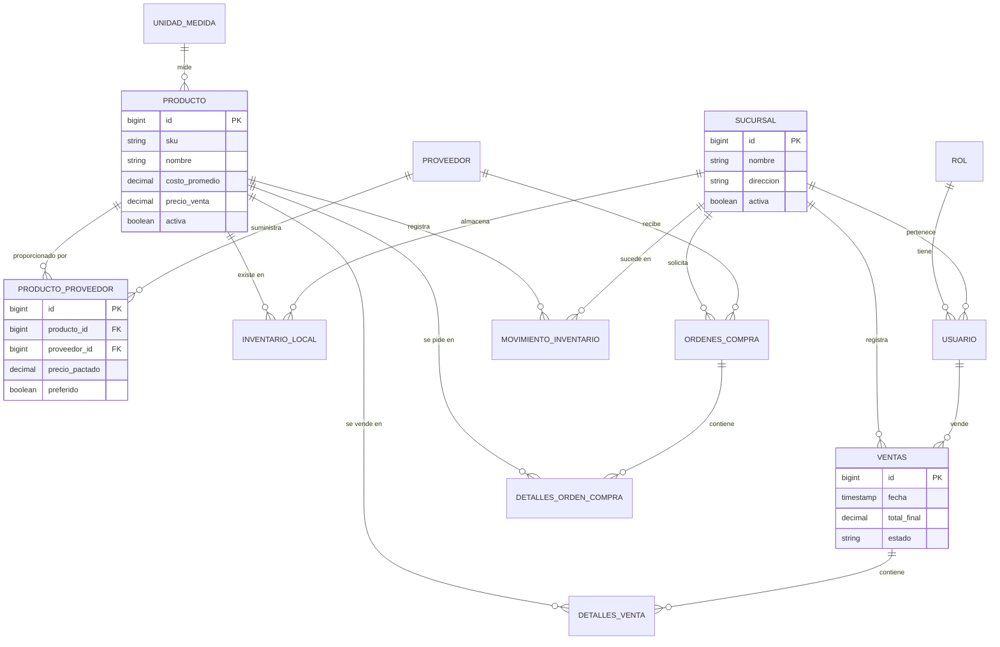

# Documentación Técnica Integrada: Zen Inventory (OptiPlant)

Este documento contiene los diagramas de ingeniería requeridos para la comprensión técnica del sistema de gestión de inventario multi-sucursal.

---

## 1. Diagrama de Casos de Uso
Describe los actores del sistema y sus interacciones principales con los módulos funcionales.

```mermaid
useCaseDiagram
    actor "Administrador" as Admin
    actor "Gerente de Sucursal" as Gerente
    actor "Operador de Inventario" as Operador

    package "Módulo de Catálogo" {
        usecase "Gestionar Productos y Proveedores" as UC1
        usecase "Configurar Listas de Precios" as UC2
    }

    package "Módulo de Operaciones" {
        usecase "Realizar Ventas" as UC3
        usecase "Solicitar Traslados" as UC4
        usecase "Gestionar Órdenes de Compra" as UC5
    }

    package "Módulo de Auditoría" {
        usecase "Ver Alertas de Stock" as UC6
        usecase "Consultar Historial de Movimientos" as UC7
    }

    Admin --> UC1
    Admin --> UC2
    Admin --> UC7
    
    Gerente --> UC3
    Gerente --> UC4
    Gerente --> UC5
    Gerente --> UC6
    
    Operador --> UC3
    Operador --> UC6
    Operador --> UC7
```

---

## 2. Diagramas de Actividades (Flujos)

### 2.1 Flujo de Venta
Proceso desde la selección de productos hasta la actualización del inventario.



### 2.2 Flujo de Transferencia entre Sucursales
Proceso logístico interno para el balance de inventario.



---

## 3. Diagrama de Arquitectura
Representación de la **Arquitectura Hexagonal (Puertos y Adaptadores)** utilizada en el backend.



---

## 4. Diagrama Entidad-Relación (E-R)
Modelo de datos completo con relaciones, basado en la estructura de `base.sql`.


